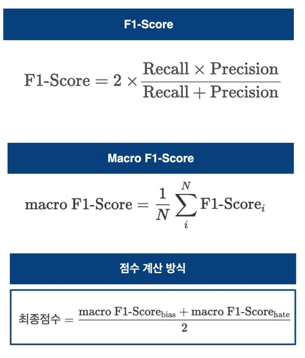
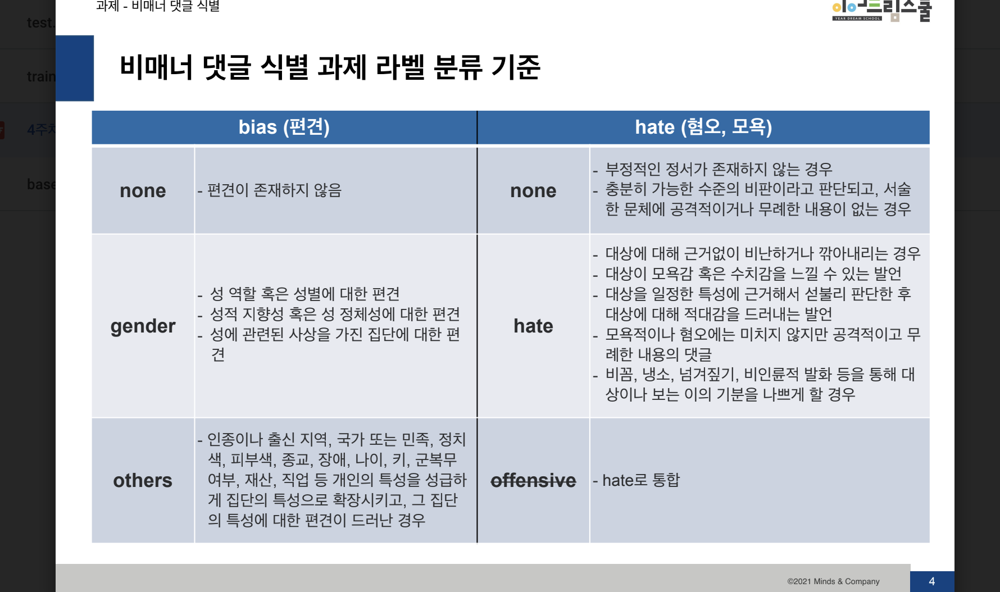

# MNC에서 주관한 비매너 댓글 식별 대회입니다

## 대회 개요
- 대회 기간 : 2022년 02월 23일 ~ 2022년 03월 04일
- 문제 정의 : 뉴스 기사의 댓글 (comment) 중 편견, 혐오 표현 (bias, hate)이 포함된 댓글을 식별하는 과제

- 추진 배경
  - 온라인 게임 속 비매너 채팅 빈도 증가 추세
  - 건전한 온라인 댓글, 채팅 문화 정착을 위한 혐오, 편견적 언어 필터링의 필요성 증대
- 평가 지표 
  

## 문제 접근방법
 자연어분야는 상당히 재미있습니다. 
<a href="https://huggingface.co/" target="_blank">hugging face</a> 라는 정말 거대한 라이브러리가 있는데요. 
github에서도 pretrained model를 가져와 사용해도 되지만, hugging face에도 많은 model들이 있습니다.  
일단, 저희가 맞추어야 하는 class를 살펴보시면, 
 
bias는 3개, hate는 2개가 있습니다. 
평가지표에서도 확인하실 수 있듯이, bias 따로 fi-score를 구하고, hate 따로 fi-score를 구해서 평균을 낸 점수가 최종 점수가 됩니다. 
 
github와 hugging face, youtube에서 class가 동일하면서도 댓글들이 다양한 데이터셋, pretrained model들을 찾아보았으며, 수 백번의 삽질끝에 아래와 같은 방법으로 진행하였습니다. 

 
저희는 test 데이터셋을 가지고 있습니다. 물론 labeling은 안 되어있습니다. 
test 데이터셋에 있는 단어들을 fine-tuning시에 넣어준다면 좋은 결과를 얻지 않을까?하는 생각에 test 데이터셋을 하나하나 뜯어보았습니다. 
 
train 데이터셋으로 fine-tuning을 진행하여도, test 데이터셋에서는 한번만 쓰이는 편견적인 단어나, 혐오적인 단어가 있을수도 있다고 생각했습니다.  
test 데이터셋에 있는 자주 등장하지 않은 편견적인 단어를 train 데이터셋에 더 넣어주고, 
test 데이터셋에 있는 자주 등장하지 않은 혐오적인 단어를 train 데이터셋에 더 넣어주고 fine-tuning을 실시한다면 좋은 결과가 나오지 않을까 생각했습니다.
