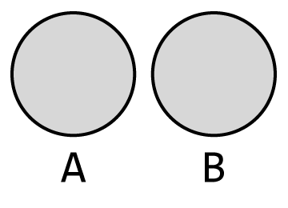

# MNC에서 주관한 비매너 댓글 식별 대회입니다

## 대회 개요
- 대회 기간 : 2022년 02월 23일 ~ 2022년 03월 04일
- 문제 정의 : 뉴스 기사의 댓글 (comment) 중 편견, 혐오 표현 (bias, hate)이 포함된 댓글을 식별하는 과제

- 추진 배경
  - 온라인 게임 속 비매너 채팅 빈도 증가 추세
  - 건전한 온라인 댓글, 채팅 문화 정착을 위한 혐오, 편견적 언어 필터링의 필요성 증대
- 평가 지표 
  

## 문제 접근방법
 자연어분야는 상당히 재미있습니다. 
<a href="https://huggingface.co/" target="_blank">hugging face</a> 라는 정말 거대한 라이브러리가 있는데요. 
github에서도 pretrained model를 가져와 사용해도 되지만, hugging face에도 많은 model들이 있습니다.  
일단, 저희가 맞추어야 하는 class를 살펴보시면, 
 
bias는 3개, hate는 2개가 있습니다. 
평가지표에서도 확인하실 수 있듯이, bias 따로 fi-score를 구하고, hate 따로 fi-score를 구해서 평균을 낸 점수가 최종 점수가 됩니다. 
 
github와 hugging face, youtube에서 class가 동일하면서도 댓글들이 다양한 데이터셋, pretrained model들을 찾아보았으며, 수 백번의 삽질끝에 아래와 같은 방법으로 진행하였습니다. 

- <a href="https://huggingface.co/beomi" target="_blank">https://huggingface.co/beomi</a> 
위의 링크를 클릭하시면,   
`beomi/beep-KcELECTRA-base-bias` 
`beomi/beep-KcELECTRA-base-hate` 
이렇게 2개의 pretrain model를 확인하실수 있으신데요. 
`beomi/beep-KcELECTRA-base-bias`와 `beomi/beep-KcELECTRA-base-hate`은 저희의 Task와 일치합니다.;;;(약간 당황스러울 정도입니다 ㅎㅎ..) 
저희는 hate의 class중 하나인 offensive가 hate로 통합되면서 이진분류로 예측을 해야합니다.(충분히 코딩으로 구현 가능합니다.) 
사실 저희가 이게 전부입니다.. 
사실 fine-tuning까지 완료되었으니깐요... 
thresholde 값만 조절해줘서 제출 완료했습니다. 

---

## 추가적인 방법론 연구
- 첫번째
 
저희는 test 데이터셋을 가지고 있습니다. 물론 labeling은 안 되어있습니다. 
test 데이터셋에 있는 단어들을 fine-tuning시에 넣어준다면 좋은 결과를 얻지 않을까?하는 생각에 test 데이터셋을 하나하나 뜯어보았습니다. 
 
train 데이터셋으로 fine-tuning을 진행하여도, test 데이터셋에서는 한번만 쓰이는 bias word나, hate word가 있을수도 있다고 생각했습니다.  
test 데이터셋에 있는 자주 등장하지 않은 bias word를 train 데이터셋에 더 넣어주고, 
test 데이터셋에 있는 자주 등장하지 않은 hate word를 train 데이터셋에 더 넣어주고 fine-tuning을 실시한다면 좋은 결과가 나오지 않을까 생각했습니다.
   
- 두번째 
이 방법은 운빨론(?)에 의지한것인데요... 
일단 저희는, pretrained model를 사용해야 한다는것이였습니다... 
첫번째 방법론의 연장선인데요. 
 
위의 이미지에서  SET A는 pretrained model이 학습할때 사용한 train data이고, 
SET B는 저희가 결과를 예측해야하는 문장인 test data라고 가정해보겠습니다. 
 
그렇다면, fine-tuning을 train data(SET A와는 다른 train data입니다!!)로 했을지라도, 
<strong>과연 test data에 대해서 결과값의 정확도가 높을수 있을까요?</strong> 
결국 첫번째 방법이 제일 좋아보이기는 했습니다만, 
현재 저희가 제출한 방법은 이 방법을 선택했다는 것이였죠...ㅜㅜ 
그래서 운빨(?)에 의지해야 했습니다....  
  

## 마무리
그래도 나름, 댓글들을 학습시킨(test data와 성격이 유사한) pretrained model를 사용했다는것과, fine-tuning과 threshold값들을 조작하여, 좋은 점수로 마무리 했던것 같습니다...
